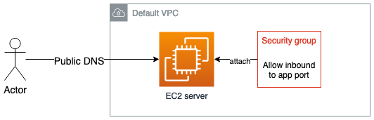

# Lesson 01

In this Lesson we'll learn about the principal concepts of Terraform:

- Providers
- Resources
- Variables
- Output
- Principal commands:
  - terraform validate
  - terraform fmt
  - terraform plan
  - terraform apply
  - terraform destroy

## What is Terraform?

Terraform is a tool for building, changing, and versioning infrastructure safely and efficiently. Terraform can manage existing and popular service providers as well as custom in-house solutions.

The infrastructure Terraform can manage includes low-level components such as compute instances, storage, and networking, as well as high-level components such as DNS entries, SaaS features, etc.

The set of files used to describe infrastructure in Terraform is simply known as a Terraform configuration. (\*.tf)

## Concepts

### Resources

In Terraform's configuration language: A Resource is a block that describes one or more infrastructure objects.

Resources can be things like virtual networks, compute instances, or higher-level components such as DNS records

Example:

```tf
resource "aws_instance" "web" {
  ami           = "ami-0b69ea66ff7391e80"
  instance_type = "t2.micro"
}
```

### Variables

Also called "input variables". In Terraform, "variables" almost always refers to input variables, which are key/value pair.

Example:

```tf
variable "ami_id" {
  description = "AMI Id to use for the EC2 instance"
  type        = string
  default     = "ami-0b69ea66ff7391e80"
  sensitive   = false
}
```

How to pass values to a variable via CLI:

```tf
$ terraform plan \
  -var 'myvar1=foo' \
  -var 'myvar2=bar'
```

#### Types of Variables

- string
- number
- bool
- list
- map
- object
- tuple

### Data Sources

Data sources allow data to be fetched or computed for use elsewhere in Terraform configuration. Use of data sources allows a Terraform configuration to make use of information defined outside of Terraform, or defined by another separate Terraform configuration.

Example:

```tf
data "aws_ami" "example" {
  most_recent = true
  owners      = ["self"]
  tags = {
    Name   = "app-server"
    Tested = "true"
  }
}
```

## Hands-on




**Instructions**

Complete `main.tf` and `variables.tf` files to create the following resources:

- Use a data source to get the default VPC of your account
- Create Security Group in the default VPC that allows traffic to the application port
- Create an EC2 server with a User Data script that runs a web server with a custom message

Follow the Terraform workflow to test your changes:

1. Write the `provider`, `data` and `resources` blocks in `*.tf` files
2. Run a `terraform init`
3. Run a `terraform plan`
4. Run a `terraform apply`
5. After you validate that everything is working fine, destory the resources with `terraform destroy`

<details>
  <summary>Solution</summary>
  
  ```tf
  provider "aws" {
    region = "us-east-1"
  }
  
  data "aws_vpc" "default" {
    default = true
  }
  
  resource "aws_instance" "server" {
    ami                    = var.ubuntu_ami
    instance_type          = var.instance_type
    vpc_security_group_ids = [aws_security_group.security_group.id]
    user_data              = <<-EOF
                                  #!/bin/bash
                                  echo "Hello world!" > index.html
                                  nohup busybox httpd -f -p ${var.server_port} &
                                  EOF
  }
  
  resource "aws_security_group" "security_group" {
    vpc_id = data.aws_vpc.default.id
  
    ingress {
      cidr_blocks = ["0.0.0.0/0"]
      description = "Web port"
      from_port   = var.server_port
      to_port     = var.server_port
      protocol    = "TCP"
    }
  }
```
</details>
