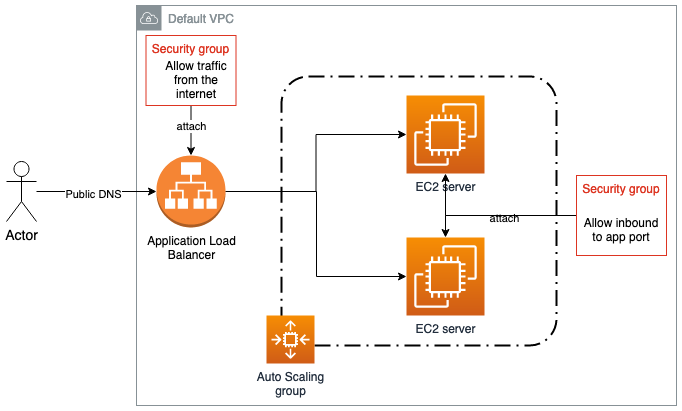

# Lesson 02

In this Lesson we'll learn how to create a high-available setup for an application using AWS Auto Scaling groups

## Hands-on



**Instructions**

Complete `main.tf` and `variables.tf` files to create the following resources:

- Use a data source to get the default VPC and subnets of your account
- Create a couple of Security Groups for the Load Balancer and the EC2 instances
- Create an Application Load Balancer with its associated resources (Listener and Target Group) to allow traffic from the internet
- Create a Launch Template and Auto Scaling Group to run EC2 servers with a User Data script that runs a web server with a custom message

Plan and apply your configuration files to validate your Terraform code.

<details>
  <summary>Solution</summary>
  
  ```tf
  data "aws_vpc" "default" {
    default = true
  }
  
  data "aws_subnets" "public" {
    filter {
      name   = "vpc-id"
      values = [data.aws_vpc.default.id]
    }
  }
  
  resource "aws_security_group" "my_sg" {
    name        = "my_sg"
    description = "Security group for my application"
    vpc_id      = data.aws_vpc.default.id
  
    ingress {
      description = "HTTP"
      from_port   = 80
      to_port     = 80
      protocol    = "tcp"
      cidr_blocks = ["0.0.0.0/0"]
    }
  }
  
  resource "aws_lb" "my_lb" {
    name            = "academy"
    security_groups = [aws_security_group.my_sg.id]
    subnets         = data.aws_subnets.public.ids
  }
  
  resource "aws_lb_listener" "http" {
    load_balancer_arn = aws_lb.my_lb.arn
    port              = "80"
    protocol          = "HTTP"
  
    default_action {
      type             = "forward"
      target_group_arn = aws_lb_target_group.tg.arn
    }
  }
  
  resource "aws_lb_target_group" "tg" {
    name     = "academy"
    port     = var.server_port
    protocol = "HTTP"
    vpc_id   = data.aws_vpc.default.id
  }
  
  resource "aws_security_group" "security_group" {
    name   = "first-server-sg"
    vpc_id = data.aws_vpc.default.id
  
    ingress {
      cidr_blocks = ["0.0.0.0/0"]
      description = "Web port"
      from_port   = var.server_port
      to_port     = var.server_port
      protocol    = "TCP"
    }
  }
  
  resource "aws_launch_template" "my_template" {
    image_id               = var.ubuntu_ami
    instance_type          = var.instance_type
    vpc_security_group_ids = [aws_security_group.security_group.id]
    user_data              = base64encode(<<-EOF
                                    #!/bin/bash
                                    echo "Hello world!" > index.html
                                    nohup busybox httpd -f -p ${var.server_port} &
                                    EOF
                                    )
  }
  
  resource "aws_autoscaling_group" "my_group" {
    launch_template {
      id      = aws_launch_template.my_template.id
      version = aws_launch_template.my_template.latest_version
    }
    min_size            = 1
    max_size            = 2
    desired_capacity    = 2
    vpc_zone_identifier = data.aws_subnets.public.ids
    target_group_arns   = [aws_lb_target_group.tg.arn]
  }
  ```
</details>
